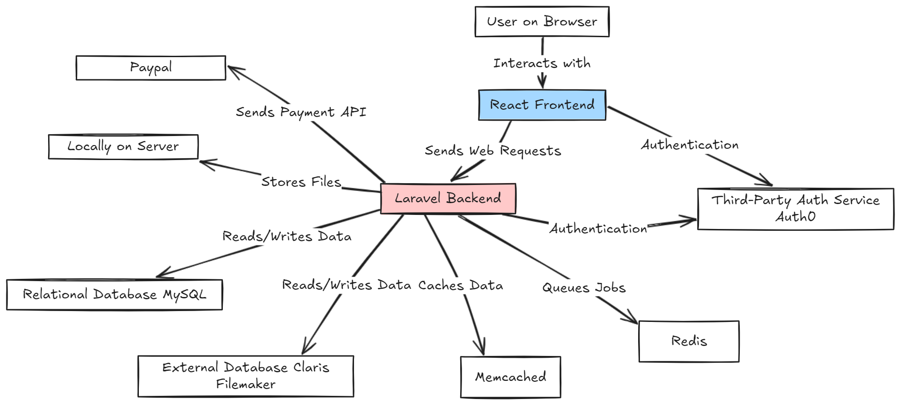

# System Architecture

This document provides an overview of the system's architecture, including the backend (Laravel), frontend (React), database design, and key design decisions. It is intended to help developers understand the structure of the application and how its components interact.

---

## 1. Overview

This project is a web application designed to provide a landing page for Postal Bible School. The application has now evolved beyond just a landing page and also provides a classroom management system for schools related to the Postal Bible School lessons both on paper and digitally. Lastly, the application contains features to allow for admin management of the website and students.

- **Tech Stack:**
  - Backend: Laravel v9.x (PHP)
  - Frontend: React v18.x (TypeScript)
  - Database: MySQL, Filemaker Pro
  - Testing: Jest, Cypress
  - Other Tools: Memcached, Redis (caching)

---

## 2. System Architecture Diagram

Below is a high-level diagram of the system architecture:



---

## 3. Backend (Laravel) Architecture

### Backend Folder Structure

The Laravel backend follows the standard Laravel framework structure ([default Laravel directory structure](https://laravel.com/docs/9.x/structure)):

``` text
app/
├── Console/          # Artisan commands
├── Http/             # Controllers, middleware, requests, resources
├── Models/           # Eloquent ORM models
├── Services/         # Custom service classes
routes/
├── api.php           # API routes
├── web.php           # Web routes
config/               # Configuration files
...
```

### Backend Key Concepts

- **Service Providers:** The following default service providers were modified to be used with the application
  
  - AppServiceProvider: Brevo (SendInBlue) package linked as a mail provider
  - EventServiceProvider: Custom student list update on succesful authentication
  - RouteServiceProvider: Sets path to the HOME route

- **Middleware:** The following default middlewares were modified to be used with the application. They are located in [app/Http/Middleware](../app/Http/Middleware/)

  - HandleInertiaRequests: Added parameters to shared props passed on every request

- **Controllers:** Located in [app/Http/Controllers](../app/Http/Controllers/). They manage the main functionality of the web application.
- **Models:** Eloquent ORM is used for data modeling and storing to the server database. All mapped Models can be found at [app/Models](../app/Models/)
- **Jobs/Queues:** Jobs allow for asynchronous backround management of tasks. Custom Jobs are located in [app/Jobs](../app/Jobs)

  - PushOrdersToFilemaker: Pushes order changes to the Filemaker database. (May not be in use. Needs further investigation).

- **APIs:** The only APIs exposed are for setting up with PayPal actions on the frontend. Located in [routes/api.php](../routes/api.php)

---

## 4. Frontend (React) Architecture

### Frontend Folder Structure

The React frontend is set to replace the standard blade views used by Laravel. They are location in the [resources/ts](../resources/ts) folder and has this structure:

``` text
ts/
├── Components/       # Reusable UI components
├── Elements/         # Reusable UI elements
├── Layouts/          # Wrapper layout components for visual structure
├── Pages/            # Page-level components
├── app.tsx           # Root file that is connecting the backend to the frontend
├── constants.tsx     # Fixed values used as constants
├── helper.tsx        # Shared functions that have common use
...
```

### Frontend Key Concepts

- **State Management:** No special state management library is used. Default React hooks and Laravel backend caching manages all requirements.
- **Routing:** Routing is handled by Laravel in the backend through [Inertia JS](https://inertiajs.com/) as the connecting adapter
- **Styling:** [TailwindCSS](https://tailwindcss.com/) is used for styling the application.
- **Component Communication:** Root components are found in the `Pages` directory which makes used of reusable UI components under `Components`. These UI components are built from basic blocks in the `Elements`. This pattern is inspired by the [Atomic Design methodology by Brad Frost](https://atomicdesign.bradfrost.com/).

---

## 5. Database and Data Flow

### Database Schema

The database schema consists of the following key tables:

- **assembly_videos:** Storing metadata for school assembly videos
- **bonus_videos:** Storing metadata for all other video content
- **classrooms:** Classroom management on the web application for each user
- **contacts:** Contact form entries from the website
- **curricula:** Curriculum of types of lesson for each month in the year
- **failed_jobs:** Laravel failed queue jobs information
- **fm_schools:** Local storage of Filemaker schools data
- **fm_students:** Local storage of Filemaker students data
- **group_requests:** Group request form entries from the website
- **individual_requests:** Individual request form entries from the website
- **jobs:** Laravel queue jobs information
- **lesson_orders:** [Description]
- **migrations:** Laravels list of migrations performed to create required tables
- **settings:** Storing settings information for the application
- **step_pasts:** Storing metadata for past STEP videos.
- **sunscool_map:** Mapping table for linking Sunscool API and Filemaker student information.

### Data Relationships

- **Classroom and Students:** One-to-Many
- **Curriculum and Classroom:** One-to-Many
- **Students and SunscoolMap:** One-to-Many

### Data Flow

1. Frontend sends web requests via Inertia routes.
2. Backend processes the request, interacts with the database, and returns a response.
3. Frontend updates the UI based on the API response.

---

## 6. Key Patterns and Decisions

- **Backend:**
  - MVC (Model-View-Controller) structure in Laravel.
  - [Other design patterns or strategies used.]

- **Frontend:**
  - Component-based design.
  - Separation of concerns for state, UI, and API logic.

- **Why Chosen:**
  - [Explain why specific technologies or patterns were chosen.]

---

## 7. Third-Party Integrations

- **Authentication:** Auth0
- **Payment Gateway:** PayPal
- **Notifications:** -
- **Analytics:** Google Analytics

---

## 8. Future Scalability

- **Horizontal Scaling:** Use of load balancers for scaling.
- **Database Scaling:** [Read replicas, partitioning.]
- **Caching:** [Describe caching strategy, e.g., Redis.]
- **Codebase Modularity:** Designed to support feature-based modularity.

---

For additional details or questions, refer to other documentation sections or reach out to the project maintainers.
